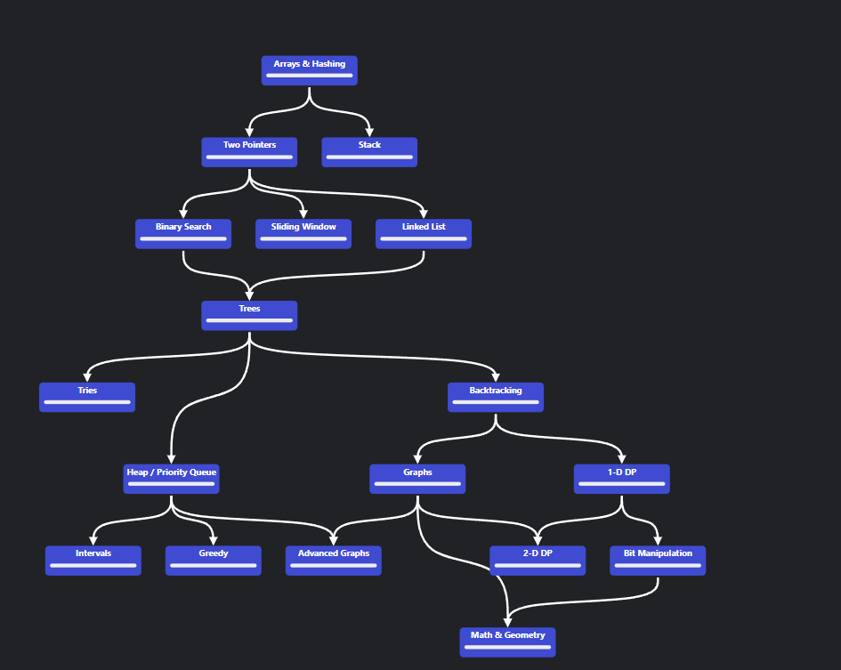

## Java-DataStructure for codegigs.app DataStructure course
### Roadmap
  
# Binary Search 
- [binary search problems](src/binary_search/neetcode_roadmap.md)

# Linked List
- [LinkedList Solid implementation notes](src/linkedlist/notes.md)

- [LinkedList problems ](src/linkedlist/problems.md)
